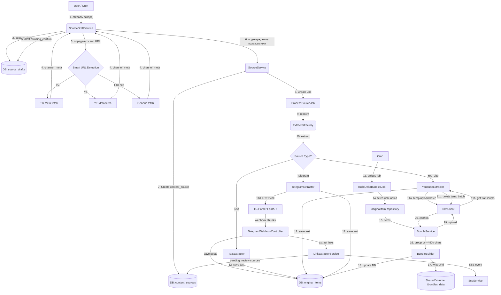

# Source Pipeline

## Архитектура и Интерфейсы (Source Pipeline)

### Общая схема (Data Flow)



---

## Smart URL Detection

При вводе URL в визарде бэкенд определяет тип источника по следующим правилам:

| Паттерн | Тип | Примечание |
|---|---|---|
| `t.me/{channel}`, `t.me/s/{channel}` | `telegram_channel` | Извлекается `channel` без `@` |
| `youtube.com/@{handle}`, `youtube.com/channel/{id}`, `youtube.com/c/{name}` | `youtube_channel` | |
| `youtube.com/playlist?list={id}` | `youtube_channel` | Плейлист обрабатывается как канал |
| `youtube.com/watch?v={id}` (без `&list=`) | `youtube_video` | |
| `youtu.be/{id}` | `youtube_video` | |
| `*.pdf` (файловый URL) | `pdf` | |
| Любой другой URL | `website` | |

**Множественный ввод URL.** Пользователь может ввести несколько ссылок, разделив их пробелом или переносом строки. Каждая ссылка обрабатывается независимо — для каждой создаётся отдельный `source_draft`. TG и YT ссылки автоматически переключаются на соответствующий тип; остальные обрабатываются как `website`.

---

## Source Draft Lifecycle

Черновик (`source_draft`) создаётся при первом вводе URL и хранит состояние визарда.

```
raw_input
    │
    ▼
fetching_meta ──(ошибка)──► abandoned
    │
    ▼
awaiting_confirm ──(закрыл визард)──► abandoned
    │ (подтвердил)
    ▼
processing ──────────────────────────────────────────► indexing ──► done ──► [удалён]
    │                                                      ▲
    │ (action=done от TG / видео загружены у YT)           │
    ▼                                                      │
awaiting_index ────────────────────────────────────────────┘
                    (нажал «Индексировать»)
```

**Замечания по переходам:**
- Для TG-каналов кнопка «Индексировать» показывается с момента перехода в `processing` — пользователь не обязан ждать окончания парсинга
- Переход `processing → indexing` (без `awaiting_index`) происходит, если пользователь нажал кнопку до получения `action=done`
- Черновик удаляется, когда `content_source.extraction_status = extracted` для основного источника. Approved-ссылки (`pending_review`) продолжают обрабатываться независимо
- `abandoned`-черновики удаляются по TTL (7 дней)

---

## SSE Events

Клиент подписывается на события черновика:

```
GET /api/sse/source-drafts/{draft_id}
Accept: text/event-stream
```

### Формат события

```
event: {event_name}
data: {json}
```

### Список событий

#### `meta_loaded`
Мета-информация об источнике загружена. Переводит черновик в `awaiting_confirm`.

```json
{
  "channel_meta": {
    "title": "Хабр",
    "description": "Лучшие статьи",
    "members": "250K",
    "avatar_url": "https://cdn.telegram.org/..."
  }
}
```

#### `parsing_progress` *(только TG)*
Промежуточный прогресс парсинга.

```json
{
  "posts_parsed": 1234,
  "links_discovered": 45
}
```

#### `links_batch` *(только TG)*
Новая пачка обнаруженных ссылок. Клиент добавляет их к уже показанным группам.

```json
{
  "links": [
    {
      "url": "https://youtu.be/dQw4w9WgXcQ",
      "type": "youtube_video",
      "domain": "youtube.com",
      "title": "Never Gonna Give You Up",
      "source_post_url": "https://t.me/habr_com/12345",
      "source_post_id": 12345
    }
  ]
}
```

#### `parsing_done` *(только TG)*
Парсинг завершён. Переводит черновик в `awaiting_index`.

```json
{
  "total_posts": 5678,
  "total_links": 89
}
```

#### `videos_loaded` *(только YT)*
Список видео канала/плейлиста загружен. Переводит черновик в `awaiting_index`.

```json
{
  "videos": [
    {
      "id": "dQw4w9WgXcQ",
      "url": "https://www.youtube.com/watch?v=dQw4w9WgXcQ",
      "title": "Название видео",
      "duration": 212,
      "thumbnail": "https://i.ytimg.com/vi/..."
    }
  ]
}
```

#### `extraction_done`
Извлечение основного источника завершено (`extraction_status = extracted`). Черновик будет удалён.

```json
{
  "content_source_id": "uuid",
  "items_count": 5678
}
```

#### `error`
Ошибка на любом этапе.

```json
{
  "code": "channel_not_found",
  "message": "Канал не найден или недоступен"
}
```

---

## Content Source Types

| Тип | Сервис | Примечание |
|---|---|---|
| Telegram channel | TG Scraper FastAPI | Поллинг новых постов по `last_id` |
| YouTube channel / playlist | yt-dlp FastAPI | Извлекает список video URL; видео добавляются в NLM как YouTube-источники |

### TG Channel Flow

Парсинг TG-канала происходит **до** нажатия «Индексировать». Посты сохраняются в `original_items` в процессе парсинга — ещё пока пользователь просматривает обнаруженные ссылки.

```
1. [Визард] Пользователь вставляет URL канала
2. GET /channel/{channel} → channel_meta → SSE: meta_loaded
3. Пользователь задаёт фильтры (limit, from_date, to_date, from_id, to_id)
4. Подтверждает → создаётся content_source, POST /scrape запускает парсинг (202 Accepted)
   draft.status = processing

5. Парсер присылает webhook-пачки (action=upload):
   a. Сохраняем посты в original_items
   b. LinkExtractorService извлекает ссылки из текстов постов:
      - Проверяет дубликаты по content_sources.url
      - Создаёт content_sources с:
          discovery_method = auto_extracted
          review_status = pending_review
          parent_source_id = <TG channel source id>
          parent_item_id = <original_item id конкретного поста>
   c. SSE: parsing_progress, links_batch
   
6. Парсер присылает webhook (action=done)
   content_source.extraction_status = extracted
   draft.status = awaiting_index
   SSE: parsing_done

7. [Визард] Пользователь просматривает сгруппированные ссылки:
   - Группировка по domain/type на уровне API
   - Каждая ссылка отображается с source_post_url (из parent_item_id → original_item.source_url)
   - По умолчанию все группы отмечены (opt-in)
   - Пользователь снимает галочки с нежелательных групп или отдельных ссылок

8. Пользователь нажимает «Индексировать»:
   - Отмеченные ссылки → review_status = approved → ProcessSourceJob
   - Снятые ссылки → review_status = rejected
   - draft.status = indexing

9. draft удаляется после extraction_done для основного TG-источника
   (approved linked sources обрабатываются независимо)
```

**Нажатие «Индексировать» во время парсинга (шаг 5):**
- Ссылки, поступившие до нажатия, обрабатываются согласно выборке пользователя
- Ссылки, поступившие после нажатия, авто-апрувятся / отклоняются на основе группового правила «все выбраны / все сняты»

---

### YouTube Flow (Batched Extraction via Temporary Notebook)

yt-dlp сервис извлекает URL видео из канала/плейлиста.
Для YouTube мы используем NLM как «чёрный ящик» для извлечения транскриптов.

```
1. [Визард] Пользователь вставляет URL канала/плейлиста
2. POST /api/v1/extract → channel_meta + video list
   SSE: meta_loaded (с video_count)
   draft.status = awaiting_confirm

3. Пользователь подтверждает → создаётся content_source
   SSE: videos_loaded (полный список видео)
   draft.status = awaiting_index

4. Пользователь нажимает «Индексировать»
   draft.status = indexing

5. Extraction job запускается:
   a. Получаем/создаём Temporary Extraction Notebook (один технический на сервис)
   b. Разбиваем URL на пачки (batch_size = свободные слоты в ноутбуке)
   c. Для каждой пачки:
      — загружаем URL во временный ноутбук
      — извлекаем транскрипты
      — НЕМЕДЛЕННО удаляем эти URL из временного ноутбука
      — сохраняем транскрипты в original_items
   
6. content_source.extraction_status = extracted
   SSE: extraction_done
   draft удаляется
```

---

### URL Flow (website / pdf / single video)

```
1. [Визард] Пользователь вставляет одну или несколько ссылок (пробел / перенос строки)
2. Для каждой ссылки:
   a. Smart URL Detection определяет тип
   b. Если telegram_channel или youtube_channel/playlist → создаётся draft соответствующего типа,
      сценарий продолжается по TG Flow или YouTube Flow
   c. Иначе → draft с типом website / pdf / youtube_video
3. Для website / pdf: мета-данные (title, description) → draft.status = awaiting_confirm
4. Пользователь подтверждает → content_source создаётся → стандартный ProcessSourceJob
```

---

## Linked Content Extraction Flow

### 1. Парсинг и классификация (Backend)
Во время работы `TelegramExtractor` текст каждого поста прогоняется через `LinkExtractorService`:

- **Фильтрация:** только поддерживаемые типы (YouTube, известные статьи, PDF)
- **Дедупликация:** проверка по `content_sources.url` — уже существующие ссылки игнорируются
- **Создание кандидатов:** уникальные ссылки сохраняются в `content_sources`:
  - `discovery_method = auto_extracted`
  - `review_status = pending_review`
  - `parent_source_id` = ID TG-канала
  - `parent_item_id` = ID `original_item` конкретного поста (используется для отображения «ссылка найдена в посте X» на фронте)

### 2. Агрегация и группировка (API)
Бэкенд группирует `pending_review`-источники по домену/типу:

```json
[
  { "domain": "youtube.com", "type": "youtube_video", "count": 45, "items": [...] },
  { "domain": "habr.com",    "type": "website",       "count": 12, "items": [...] },
  { "domain": "t.me",        "type": "telegram_channel", "count": 3, "items": [...] }
]
```

Каждый `item` включает `source_post_url` (из `parent_item_id → original_item.source_url`) — чтобы пользователь мог просмотреть оригинальный пост.

### 3. Подтверждение пользователем
- **«Ленивый» сценарий:** нажать «Индексировать всё» — все pending источники получают `review_status = approved`
- **«Точный» сценарий:** снять галочку с группы или отдельной ссылки → `review_status = rejected`

### 4. Обработка и Parent-Child связь
После `review_status = approved` → `ProcessSourceJob` обрабатывает источник.  
`original_items.parent_item_id` связывает извлечённый контент с исходным постом, где была найдена ссылка.

---

## MD Bundle Strategy

### Принцип: write-once

Бандл создаётся один раз, загружается в NotebookLM и **никогда не изменяется**. Новый контент → новый бандл. Ноль переиндексаций.

### Первичная индексация

```
Все original_items (md_bundle_id IS NULL)
    ↓
Сортировка по published_at
    ↓
Пакуем в FULL бандлы (макс. 490k символов, запас 10k)
    ↓
Загружаем в NotebookLM → ждём индексации
    ↓
Freeze навсегда
```

### Живые обновления (auto_update = true)

Scheduler запускается каждые N минут. Job уникальный (`->unique()`).

```
1. Для каждого content_source WHERE auto_update = true:
   — TG: GET /scrape?from_id=last_fetched_id → новые посты via webhook
   — YT: POST /api/v1/extract → сравниваем video list с known video_ids → новые видео в очередь
   
2. Сохраняем новые original_items (md_bundle_id = null)
3. Обновляем last_fetched_id / last_fetched_at

4. BuildDeltaBundlesJob:
   unbundled_chars = SUM(LENGTH(text)) WHERE md_bundle_id IS NULL

   IF unbundled_chars >= 50_000
   OR (последний бандл > 24h назад AND unbundled_chars > 0):
       → компилируем md-файл → md_bundle (status=PENDING) → очередь на загрузку
```

---

## Bundle File Format

```markdown
<!-- SOURCE_ID: tg_12345 | URL: https://t.me/channel/12345 | TS: 2024-01-15T10:30:00 -->
Текст поста 12345. Может быть многострочным.
Продолжение текста того же поста.

<!-- SOURCE_ID: tg_12346 | URL: https://t.me/channel/12346 | TS: 2024-01-15T11:00:00 -->
Текст поста 12346.

<!-- SOURCE_ID: yt_dQw4w9WgXcQ | URL: https://youtube.com/watch?v=dQw4w9WgXcQ | TS: 2024-01-10T00:00:00 -->
Транскрипция видео или описание.
```

**Формат SOURCE_ID:** `{type}_{external_id}`, например `tg_12345`, `yt_dQw4w9WgXcQ`.

---

## Citation Resolution

```
1. По notebooklm_source_id находим md_bundle
2. Читаем bundle file
3. Ищем cited_text substring в файле
4. Сканируем назад от позиции совпадения до первого <!-- SOURCE_ID: -->
5. Извлекаем external_id из метаданных
6. Достаём original_item WHERE external_id = extracted_id
7. Возвращаем: { url, text, published_at }
```

**Edge case: cited_text пересекает границу двух постов.**  
Алгоритм вернёт пост, где цитата начинается (ближайший SOURCE_ID выше). Для MVP приемлемо. Пустая строка-разделитель снижает вероятность склейки (заложено в формат).

---

## Ключевые классы и интерфейсы

- **`SourceDraftService`**: Создаёт и управляет `source_drafts`. Оркестрирует переходы статусов. Вызывает `SmartUrlDetector` и отправляет SSE-события через `SseService`.
- **`SmartUrlDetector`**: Определяет тип источника по URL (правила в разделе Smart URL Detection).
- **`SseService`**: Отправляет события на SSE-канал `/api/sse/source-drafts/{draft_id}`.
- **`SourceService`** (Оркестратор): Главный фасад. Валидирует данные, создаёт `content_source`, диспатчит `ProcessSourceJob`. Вызывается из `SourceDraftService` после подтверждения пользователем.
- **`ProcessSourceJob`**: Laravel Job (`ShouldBeUnique`). Вызывает `ExtractorFactory`, сохраняет результат, обновляет `source_draft.status`.
- **`ExtractorFactory`**: Возвращает нужный экстрактор по типу источника.
- **`SourceExtractorInterface`**: Контракт `extract(ContentSource $source): void`.
  - `TextExtractor`: Сохраняет готовый текст.
  - `YouTubeExtractor`: Работает с `NlmClient` для пакетного извлечения транскриптов через временный ноутбук.
  - `TelegramExtractor`: Инициирует асинхронный парсинг через FastAPI. Возвращает управление сразу (202); результаты приходят через webhook.
- **`TelegramWebhookController`**: Принимает webhook-пачки от TG Scraper. Сохраняет `original_items`, вызывает `LinkExtractorService`, отправляет SSE-события.
- **`LinkExtractorService`**: Извлекает и дедуплицирует ссылки из текста постов. Создаёт `content_sources` с `pending_review`.
- **`BundleService`**: Управляет созданием дельта-бандлов. Вызывается по крону.
- **`BundleBuilder`**: Инкапсулирует логику накопления текста до лимита ~490k символов и рендеринга MD-файла.

---

## Обработка ошибок

В `ProcessSourceJob` и экстракторах применяется матрица решений:

1. **Фатальные ошибки (Known/Fatal)**:
   - *Примеры:* видео приватное, невалидный URL, канал TG не существует
   - *Действие:* `content_source.extraction_status = error`, сохранение понятного `error_message`, SSE: `error`, уведомление. Retry не выполняется.

2. **Транзитные ошибки (Unknown/Transient)**:
   - *Примеры:* таймаут NLM, 500 от TG API, обрыв сети
   - *Действие:* исключение пробрасывается, Laravel Queue делает retry (3 попытки с экспоненциальной задержкой).

---

## Метрики и Лимиты Бандлов

- **Подсчёт размера:** строгий подсчёт символов, токенизация не требуется
- **Лимит бандла:** ~490 000 символов (запас 10k до жёсткого лимита NLM в 500k)
- **Стратегия:** write-once. Бандлы не редактируются и не удаляются при изменении оригинальных постов

---

## DB Tables

> ⚠️ **Примечание:** Каноническая схема БД описана в `data-model.md`. Ниже — упрощённая версия для контекста Source Pipeline. В случае расхождений ориентируйтесь на `data-model.md`.

```sql
source_drafts
  id                  uuid pk
  user_id             fk
  knowledge_base_id   fk null
  content_source_id   fk null
  type                enum(telegram_channel, youtube_channel, youtube_video, website, pdf, ...)
  raw_input           text
  channel_meta        jsonb
  scrape_config       jsonb
  auto_update         boolean default false
  status              enum(fetching_meta, awaiting_confirm, processing, awaiting_index, indexing, done, abandoned)
  created_at          timestamp
  updated_at          timestamp

content_sources
  id                  uuid pk
  user_id             fk
  type                enum(telegram_channel, youtube_channel, youtube_video, website, ...)
  url                 varchar
  auto_update         boolean default false
  extraction_status   enum(pending, uploading, extracting, extracted, error)
  parent_source_id    uuid fk null
  parent_item_id      uuid fk null    -- конкретный пост, из которого взята ссылка
  discovery_method    enum(manual, auto_extracted)
  review_status       enum(pending_review, approved, rejected)
  metadata            jsonb           -- включает scrape_config для telegram_channel
  last_fetched_id     varchar
  last_fetched_at     timestamp
  created_at          timestamp

original_items
  id                  uuid pk
  content_source_id   fk
  source_url          varchar
  full_text           text
  parent_item_id      uuid fk null
  published_at        timestamp
  md_bundle_id        uuid fk null
  created_at          timestamp

md_bundles
  id                      uuid pk
  notebook_id             fk
  notebooklm_source_id    varchar null
  type                    enum(full, delta)
  status                  enum(pending, uploading, uploaded, error)
  char_count              int
  file_path               varchar
  uploaded_at             timestamp
  created_at              timestamp
```

### Indexes

```sql
CREATE INDEX ON source_drafts (user_id, status);
CREATE INDEX ON source_drafts (content_source_id);
CREATE INDEX ON content_sources (user_id, auto_update) WHERE auto_update = true;
CREATE INDEX ON content_sources (parent_source_id) WHERE parent_source_id IS NOT NULL;
CREATE INDEX ON content_sources (review_status) WHERE review_status = 'pending_review';
CREATE INDEX ON original_items (content_source_id, published_at);
CREATE INDEX ON original_items (md_bundle_id) WHERE md_bundle_id IS NULL;
CREATE INDEX ON md_bundles (notebook_id, status);
CREATE INDEX ON md_bundles (notebooklm_source_id);
```
