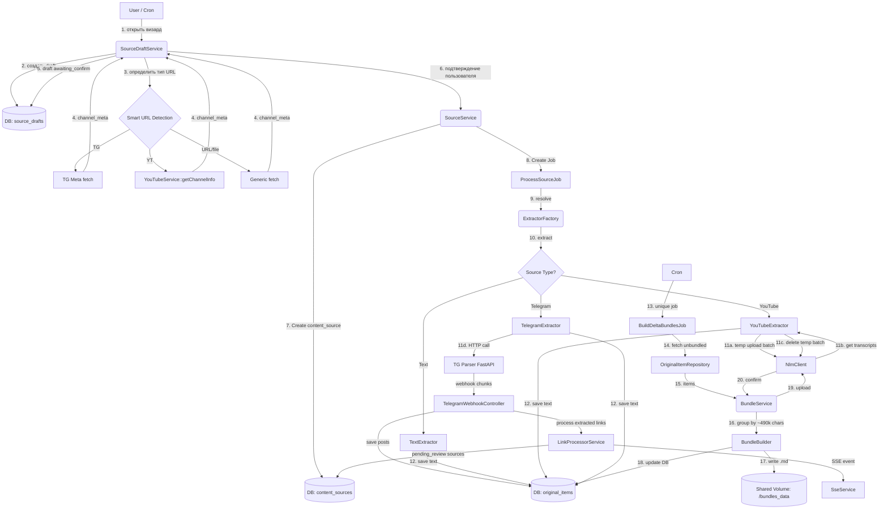

# Source Pipeline

## Архитектура и Интерфейсы (Source Pipeline)

### Общая схема (Data Flow)



> ⚠️ **Примечание к диаграмме:** Поток упрощён. Для YouTube `SourceService` и `ProcessSourceJob` вызываются не сразу после `awaiting_confirm`, а после `awaiting_index` (на шаге `indexing`), чтобы позволить пользователю подтвердить список видео перед запуском извлечения транскриптов. См. разделы "YouTube Flow" и "Ключевые классы и интерфейсы".

---

## Smart URL Detection

При вводе URL в визарде бэкенд определяет тип источника по следующим правилам:

| Паттерн | Тип | Примечание |
|---|---|---|
| `t.me/{channel}`, `t.me/s/{channel}` | `telegram_channel` | Извлекается `channel` без `@` |
| `youtube.com/@{handle}`, `youtube.com/channel/{id}`, `youtube.com/c/{name}` | `youtube_channel` | |
| `youtube.com/playlist?list={id}` | `youtube_channel` | Плейлист обрабатывается как канал |
| `youtube.com/watch?v={id}` (без `&list=`) | `youtube_video` | |
| `youtu.be/{id}` | `youtube_video` | |
| `*.pdf` (файловый URL) | `pdf` | |
| Любой другой URL | `website` | |

**Множественный ввод URL.** Пользователь может ввести несколько ссылок, разделив их пробелом или переносом строки. Каждая ссылка обрабатывается независимо — для каждой создаётся отдельный `source_draft`. TG и YT ссылки автоматически переключаются на соответствующий тип; остальные обрабатываются как `website`.

---

## Source Draft Lifecycle

Черновик (`source_draft`) создаётся при первом вводе URL и хранит состояние визарда.

```
raw_input
    │
    ▼
fetching_meta ──(ошибка)──► abandoned
    │
    ▼
awaiting_confirm ──(закрыл визард)──► abandoned
    │ (подтвердил)
    ▼
processing ──(action=done от TG / видео загружены у YT)──► awaiting_index ──(нажал «Индексировать»)──► indexing ──► done ──► [удалён]
```

**Замечания по переходам:**
- Кнопка «Индексировать» **не показывается** во время `processing`. Пользователь должен дождаться предварительной обработки и перехода в `awaiting_index`, и только после этого может нажать кнопку «Индексировать».
- Черновик удаляется, когда `content_source.extraction_status = extracted` для основного источника. Approved-ссылки (`pending_review`) продолжают обрабатываться независимо
- `abandoned`-черновики удаляются по TTL (7 дней)

**Очистка сиротских `content_sources`:**
Для TG `content_source` создаётся на этапе `awaiting_confirm` → `processing`. Если пользователь abandons визард на этапе `awaiting_index` (не нажав «Индексировать»), `source_draft` будет удалён по TTL, но `content_source` останется в БД со статусом `pending` или `extracted` (посты уже могут быть сохранены). Чтобы избежать накопления таких сирот, **требуется** внедрить фоновый job (`CleanupOrphanedSourcesJob`), который раз в сутки находит `content_sources`, созданные более N дней назад, не имеющие связанных `source_drafts` и не добавленные ни в один ноутбук (`notebook_content_sources`), и удаляет их вместе с их `original_items`.

---

## SSE Events

Клиент подписывается на события черновика через Mercure Hub (согласно архитектуре SSE):

**Топик:** `user.{userId}.source-drafts`

> ⚠️ **Важно:** Payload каждого события содержит `draft_id`, чтобы фронтенд мог фильтровать события для текущего визарда, так как топик является контекстным для всех визардов пользователя.

### Формат события

```
event: {event_name}
data: {json}
```

### Список событий

#### `meta_loaded`
Мета-информация об источнике загружена. Переводит черновик в `awaiting_confirm`.

```json
{
  "draft_id": "uuid-1234",
  "channel_meta": {
    "title": "Хабр",
    "description": "Лучшие статьи",
    "members": "250K",
    "avatar_url": "https://cdn.telegram.org/..."
  }
}
```

#### `parsing_progress` *(только TG)*
Промежуточный прогресс парсинга.

```json
{
  "draft_id": "uuid-1234",
  "posts_parsed": 1234,
  "links_discovered": 45
}
```

#### `links_batch` *(только TG)*
Новая пачка обнаруженных ссылок. Клиент добавляет их к уже показанным группам.

```json
{
  "draft_id": "uuid-1234",
  "links": [
    {
      "url": "https://youtu.be/dQw4w9WgXcQ",
      "type": "youtube_video",
      "domain": "youtube.com",
      "title": "Never Gonna Give You Up",
      "source_post_url": "https://t.me/habr_com/12345",
      "source_post_id": 12345
    },
    {
      "url": "https://t.me/target_channel/101",
      "type": "telegram_post",
      "domain": "t.me",
      "channel": "@target_channel",
      "source_post_url": "https://t.me/habr_com/12345",
      "source_post_id": 12345
    }
  ]
}
```

#### `parsing_done` *(только TG)*
Парсинг завершён. Переводит черновик в `awaiting_index`.

```json
{
  "draft_id": "uuid-1234",
  "total_posts": 5678,
  "total_links": 89
}
```

#### `videos_loaded` *(только YT)*
Список видео канала/плейлиста загружен. Переводит черновик в `awaiting_index`.

```json
{
  "draft_id": "uuid-1234",
  "videos": [
    {
      "id": "dQw4w9WgXcQ",
      "url": "https://www.youtube.com/watch?v=dQw4w9WgXcQ",
      "title": "Название видео",
      "duration": 212,
      "thumbnail": "https://i.ytimg.com/vi/..."
    }
  ]
}
```

#### `extraction_done`
Извлечение основного источника завершено (`extraction_status = extracted`). Черновик будет удалён.

```json
{
  "draft_id": "uuid-1234",
  "content_source_id": "uuid",
  "items_count": 5678
}
```

#### `error`
Ошибка на любом этапе.

```json
{
  "draft_id": "uuid-1234",
  "code": "channel_not_found",
  "message": "Канал не найден или недоступен"
}
```

---

## Content Source Types

| Тип | Сервис | Примечание |
|---|---|---|
| Telegram channel | TG Scraper FastAPI | Поллинг новых постов по `last_id` |
| YouTube channel / playlist | YouTubeService | Извлекает список video URL через Google YouTube Data API; видео добавляются в NLM как YouTube-источники |

### TG Channel Flow

Парсинг TG-канала происходит **до** нажатия «Индексировать». Посты сохраняются в `original_items` в процессе парсинга — ещё пока пользователь просматривает обнаруженные ссылки.

```
1. [Визард] Пользователь вставляет URL канала
2. GET /channel/{channel} → channel_meta → SSE: meta_loaded
3. Пользователь задаёт фильтры (limit, from_date, to_date, from_id, to_id)
4. Подтверждает → создаётся content_source, POST /scrape запускает парсинг (202 Accepted)
   draft.status = processing

5. Парсер присылает webhook-пачки (action=upload):
   a. Сохраняем посты в original_items
   b. tg-scrapper самостоятельно извлекает ссылки из текста каждого поста и присылает их в поле `links` этого поста в webhook-пачке. Backend (LinkProcessorService) обрабатывает их:
      - Проверяет дубликаты по content_sources.url
      - Создаёт content_sources с:
          discovery_method = auto_extracted
          review_status = pending_review
          parent_source_id = <TG channel source id>
          parent_item_id = <original_item id конкретного поста>
   c. SSE: parsing_progress, links_batch
   
6. Парсер присылает webhook (action=done)
   content_source.extraction_status = extracted
   draft.status = awaiting_index
   SSE: parsing_done

7. [Визард] Пользователь просматривает сгруппированные ссылки:
   - Группировка по домену/типу на уровне API. **Для YouTube-ссылок группировка происходит по каналам** с помощью `YouTubeService::resolveChannelUrls` (метод пачками разрешает имя канала по URL видео).
   - Каждая ссылка отображается с source_post_url (из parent_item_id → original_item.source_url)
   - По умолчанию все группы отмечены (opt-in)
   - Пользователь снимает галочки с нежелательных групп или отдельных ссылок

8. Пользователь нажимает «Индексировать» (кнопка доступна только после перехода в `awaiting_index`):
   - Отмеченные ссылки → review_status = approved → ProcessSourceJob
   - Снятые ссылки → review_status = rejected
   - draft.status = indexing

9. draft удаляется после extraction_done для основного TG-источника
   (approved linked sources обрабатываются независимо)
```

---

### YouTube Flow (Batched Extraction via Temporary Notebook)

Для получения метаданных и списка видео используется `YouTubeService` (Google YouTube Data API v3).
Для извлечения транскриптов мы используем NLM как «чёрный ящик».

```
1. [Визард] Пользователь вставляет URL канала/плейлиста
2. YouTubeService::getChannelInfo → получаем инфо о канале
   SSE: meta_loaded (с channel_meta)
   draft.status = awaiting_confirm

3. [Визард] Пользователь подтверждает, что канал выбран верно.
   UI предоставляет выбор типа контента для индексации: videos / shorts / streams.
   (По умолчанию opt-in на videos и shorts).
   Пользователь нажимает «Далее» / «Загрузить список видео».
   draft.status = processing
   YouTubeService::getVideoUrls(id, types) → получаем список URL видео согласно выбранному фильтру
   (content_source ещё не создаётся, чтобы избежать сирот при отказе пользователя)

4. SSE: videos_loaded (полный список видео)
   draft.status = awaiting_index
   [Визард] Пользователь видит список видео, может снять галочки с ненужных.

5. Пользователь нажимает «Индексировать»
   draft.status = indexing
   SourceService создаёт content_source и диспатчит ProcessSourceJob.
   Extraction job запускается:
   a. Запрашиваем у AccountService свободный тех. ноутбук типа source_extractor с максимальным количеством свободных слотов
   b. Если все существующие ноутбуки заполнены (full), AccountService пытается создать новый (Burst-режим) на свободном аккаунте
   c. Динамическое батчингование: от общего массива URL отрезаем ровно столько, сколько влезает в текущий ноутбук (available_slots = max_sources - sources_count)
   d. Захватываем distributed lock на ноутбук через AccountService::acquireTechNotebookLock()
   e. Для каждой пачки:
      — загружаем URL во временный ноутбук
      — извлекаем транскрипты
      — НЕМЕДЛЕННО удаляем эти URL из временного ноутбука (в блоке finally)
      — сохраняем транскрипты в original_items
      — освобождаем lock
   f. Если в массиве URL остались необработанные элементы, повторяем цикл с шага (a) для следующей пачки
   
6. content_source.extraction_status = extracted
   SSE: extraction_done
   draft удаляется

**Crash Recovery:** если extraction job упадёт до вызова deleteSources, источники останутся в тех. ноутбуке. Фоновый `CleanupStaleTechNotebooksJob` раз в 15 минут находит ноутбуки со статусом `busy` и `locked_at < now() - 15 minutes`, принудительно очищает их через NLM API и сбрасывает статус в `idle`. Если очистка не удалась (сессия протухла), ноутбук помечается как `degraded`, и `MaintainTechNotebooksPoolJob` создаст новый взамен.
```

---

### URL Flow (website / pdf / single video)

```
1. [Визард] Пользователь вставляет одну или несколько ссылок (пробел / перенос строки)
2. Для каждой ссылки:
   a. Smart URL Detection определяет тип
   b. Если telegram_channel или youtube_channel/playlist → создаётся draft соответствующего типа,
      сценарий продолжается по TG Flow или YouTube Flow
   c. Иначе → draft с типом website / pdf / youtube_video
3. Для website / pdf: мета-данные (title, description) → draft.status = awaiting_confirm
4. Пользователь подтверждает → content_source создаётся → стандартный ProcessSourceJob
```

---

## Linked Content Extraction Flow

### 1. Извлечение и классификация (tg-scrapper + Backend)
`tg-scrapper` самостоятельно извлекает ссылки из текста каждого поста и присылает их в поле `links` этого поста в webhook-пачке. Backend (`LinkProcessorService`) принимает эти ссылки:

- **Фильтрация вложенных каналов:** Ссылки на Telegram-каналы без ID поста (например, `t.me/channel_username`) **игнорируются и отбрасываются**. Система не поддерживает рекурсивную индексацию вложенных каналов.
- **Фильтрация типов:** принимаются только ссылки на посты из других каналов (например, `t.me/channel_username/123`)
- **Дедупликация:** проверка по `content_sources.url` — уже существующие ссылки игнорируются
- **Создание кандидатов:** уникальные ссылки сохраняются в `content_sources`:
  - `discovery_method = auto_extracted`
  - `review_status = pending_review`
  - `parent_source_id` = ID TG-канала
  - `parent_item_id` = ID `original_item` конкретного поста (используется для отображения «ссылка найдена в посте X» на фронте)

### 2. Агрегация и группировка (API)
Бэкенд группирует `pending_review`-источники:
- **YouTube-ссылки:** группировка происходит **по каналам** с использованием `YouTubeService::resolveChannelUrls` (метод пачками разрешает имя канала по URL видео).
- **Telegram-ссылки:** группировка происходит **по исходному каналу** (а не по домену `t.me`). Это позволяет пользователю видеть «Канал @news_channel (3 поста)» и осознанно снимать галочки с целых каналов-источников.
- **Остальные типы:** группировка по домену/типу.

```json
[
  { "domain": "youtube.com", "type": "youtube_video", "channel": "@some_channel", "count": 45, "items": [...] },
  { "domain": "t.me",        "type": "telegram_post", "channel": "@target_channel_1", "count": 3, "items": [...] },
  { "domain": "habr.com",    "type": "website",       "count": 12, "items": [...] }
]
```

Каждый `item` включает `source_post_url` (из `parent_item_id → original_item.source_url`) — чтобы пользователь мог просмотреть оригинальный пост.

### 3. Подтверждение пользователем
- **«Ленивый» сценарий:** нажать «Индексировать всё» — все pending источники получают `review_status = approved`
- **«Точный» сценарий:** снять галочку с группы или отдельной ссылки → `review_status = rejected`

### 4. Обработка и Parent-Child связь
После `review_status = approved` → `ProcessSourceJob` обрабатывает источник.  
`original_items.parent_item_id` связывает извлечённый контент с исходным постом, где была найдена ссылка.

---

## MD Bundle Strategy

### Принцип: write-once для первичной индексации

**Full бандлы** (первичная индексация) создаются один раз, загружаются в NotebookLM и **никогда не изменяются**. Новый контент → новый бандл. Ноль переиндексаций.

### Первичная индексация

```
Все original_items (md_bundle_id IS NULL)
    ↓
Сортировка по published_at
    ↓
Пакуем в FULL бандлы (макс. 490k символов, запас 10k)
    ↓
Загружаем в NotebookLM → ждём индексации
    ↓
Freeze навсегда
```

### Живые обновления и delta_bundle

Живые обновления (auto_update = true), а также остаточные данные от первичной индексации (которые не поместились в последний full бандл из-за лимита ~490k символов), обрабатываются через **`delta_bundle`**.

В отличие от full бандлов, `delta_bundle` **может перезаписываться** в NotebookLM по мере поступления новых данных для индексации. Это позволяет не плодить множество мелких бандлов для частых обновлений.

**Логика работы `delta_bundle`:**
1. Scheduler запускается каждые N минут. Job уникальный по `notebook_id` (`->unique($this->notebook_id)`), чтобы блокировка одного ноутбука не останавливала сборку дельт для остальных.
2. Для каждого `content_source` WHERE `auto_update = true`:
   — TG: GET /scrape?from_id=last_fetched_id → новые посты via webhook. Если Scraper занят (409), job падает с транзитной ошибкой и ретраится. Поскольку дельта (постов с последнего обновления) обычно мала, парсинг занимает секунды, и конкуренция за скрапер минимальна.
   — YT: YouTubeService::getVideoUrls → сравниваем video list с known video_ids → новые видео в очередь
3. Сохраняем новые `original_items` (md_bundle_id = null)
4. После успешного завершения автообновления (получения `action=done` от скрапера) `content_source.last_fetched_id` обновляется до максимального ID среди только что полученных постов.
5. `BuildDeltaBundlesJob`:
   - Находим активный `delta_bundle` для ноутбука (если есть и его размер < 490k символов).
   - Добавляем новые unbundled items в этот `delta_bundle`.
   - Перезаписываем содержимое источника в NotebookLM (обновляем md-файл).
   - **Если размер `delta_bundle` достигает ~490k символов**, он становится неизменяемым (freeze, write-once), и для последующих обновлений создаётся **новый `delta_bundle`**.

---

## Bundle File Format

```markdown
>VQ6EAOKbQdSnFkRmVUQAAA
Текст поста 12345. Может быть многострочным.
Продолжение текста того же поста.

>8x9BpLqR2mN5vK3jW7tYzA
Текст поста 12346.

>kL3mN5vK3jW7tYzAVQ6EAA
Транскрипция видео или описание.
```

**Формат заголовка:** `>` + 22 символа Base64URL-кодированного UUID (`original_items.id`). Это даёт фиксированный overhead ~24 байта на пост вместо 88+ байт у HTML-комментариев. URL, timestamp и прочие метаданные доизвлекаются из БД по UUID при резолвинге цитат.

---

## Citation Resolution

```
1. По notebooklm_source_id находим md_bundle
2. Читаем bundle file
3. Ищем cited_text substring в файле
4. Сканируем назад от позиции совпадения до первого вхождения `>` в начале строки
5. Считываем следующие 22 символа, валидируем регулярным выражением `^[A-Za-z0-9_-]{22}$`
6. Декодируем Base64URL обратно в UUID
7. Достаём original_item WHERE id = decoded_uuid
8. Возвращаем: { url, text, published_at }
```

**Edge case: cited_text пересекает границу двух постов.**  
Алгоритм вернёт пост, где цитата начинается (ближайший заголовок выше). Для MVP приемлемо. Пустая строка-разделитель снижает вероятность склейки (заложено в формат).

---

## Ключевые классы и интерфейсы

- **`SourceDraftService`**: Создаёт и управляет `source_drafts`. Оркестрирует переходы статусов. Вызывает `SmartUrlDetector` и отправляет SSE-события через `SseService`.
- **`SmartUrlDetector`**: Определяет тип источника по URL (правила в разделе Smart URL Detection).
- **`SseService`**: Отправляет события на SSE-канал `/api/sse/source-drafts/{draft_id}`.
- **`SourceService`** (Оркестратор): Главный фасад. Валидирует данные, создаёт `content_source`, диспатчит `ProcessSourceJob`.
  - Для TG: вызывается при подтверждении канала (`awaiting_confirm` → `processing`). Запускает внешний парсер через `TelegramExtractor`.
  - Для YT: вызывается после загрузки и подтверждения списка видео (`awaiting_index` → `indexing`). Запускает извлечение транскриптов через `YouTubeExtractor`.
- **`ProcessSourceJob`**: Laravel Job (`ShouldBeUnique`, уникальный по `content_source_id`). Является «тонким» диспетчером: не содержит бизнес-логики, а лишь разрешает зависимости и делегирует выполнение бизнес-сервису `SourceIndexingService::process($draftId)`.
- **`SourceIndexingService`**: Инкапсулирует всю бизнес-логику индексации: сбор данных для MD Bundle, вызов NotebookLM API, обработку ответов, сохранение результатов в БД, обновление статусов и отправку финальных SSE-событий.
- **`ExtractorFactory`**: Возвращает нужный экстрактор по типу источника.
- **`SourceExtractorInterface`**: Контракт `extract(ContentSource $source): void`.
  - `TextExtractor`: Сохраняет готовый текст.
  - `YouTubeExtractor`: Работает с `NlmClient` для пакетного извлечения транскриптов через временный ноутбук.
  - `TelegramExtractor`: Инициирует парсинг через FastAPI. Job блокируется на время парсинга (через удержание `ShouldBeUnique` локи по `content_source_id`), что предотвращает дублирование запросов к скраперу. Результаты приходят через webhook.
- **`TelegramWebhookController`**: Принимает webhook-пачки от TG Scraper. Сохраняет `original_items`, вызывает `LinkProcessorService`, отправляет SSE-события.
- **`LinkProcessorService`**: Принимает ссылки из поля `links` каждого поста в webhook-пачках `tg-scrapper`, фильтрует вложенные каналы (игнорируя ссылки без ID поста), дедуплицирует их и создаёт `content_sources` со статусом `pending_review`.
- **`BundleService`**: Управляет созданием дельта-бандлов. Вызывается по крону.
- **`BundleBuilder`**: Инкапсулирует логику накопления текста до лимита ~490k символов и рендеринга MD-файла.

---

## Восстановление после сбоя TG-парсинга

Если Scraper прислал часть чанков и упал (или `action=done` не пришёл), `content_source` остаётся в статусе `uploading` бесконечно. Для production-готовности реализуются следующие механизмы:

1. **Timeout + Retry:** Scheduler раз в N минут проверяет `content_sources` WHERE `extraction_status = 'uploading'` AND `updated_at < now() - interval '30 minutes'`. Если находит — сбрасывает статус в `pending` и повторно диспатчит `ProcessSourceJob`. Скрапер возобновляет парсинг с `last_fetched_id` (или `from_id`), чтобы не дублировать уже сохранённые посты

---

## Обработка ошибок

В `ProcessSourceJob` и экстракторах применяется матрица решений:

1. **Фатальные ошибки (Known/Fatal)**:
   - *Примеры:* видео приватное, невалидный URL, канал TG не существует
   - *Действие:* `content_source.extraction_status = error`, сохранение понятного `error_message`, SSE: `error`, уведомление. Retry не выполняется.

2. **Транзитные ошибки (Unknown/Transient)**:
   - *Примеры:* таймаут NLM, 500 от TG API, обрыв сети
   - *Действие:* исключение пробрасывается, Laravel Queue делает retry (3 попытки с экспоненциальной задержкой).

3. **Достигнут лимит источников в ноутбуке (Notebook Limit Exceeded)**:
   - *Сценарий:* при загрузке `md_bundle` в пользовательский ноутбук выясняется, что `sources_count >= max_sources` (например, 50 для Free tier).
   - *Действие:* операция прерывается, бандлу присваивается статус `error` с `error_code = 'notebook_limit_exceeded'`. Пользователю через SSE или HTTP-ответ возвращается четкая ошибка: *"Достигнут лимит источников для текущего тарифа. Обновите аккаунт или очистите базу знаний"*. Никакого автоматического создания второго ноутбука для одной Knowledge Base (сохраняем правило "One KB = one NLM notebook").
   - *Возобновление:* при апгрейде аккаунта (изменение `pool_type` в `tech_accounts`), cron-job проверяет `error` бандлы с `error_code = 'notebook_limit_exceeded'` и возобновляет загрузку.

---

## Метрики и Лимиты Бандлов

- **Подсчёт размера:** строгий подсчёт символов, токенизация не требуется
- **Лимит бандла:** ~490 000 символов (запас 10k до жёсткого лимита NLM в 500k)
- **Стратегия:** write-once. Бандлы не редактируются и не удаляются при изменении оригинальных постов

---

## DB Tables

> ⚠️ **Примечание:** Каноническая схема БД описана в `data-model.md`. Ниже — упрощённая версия для контекста Source Pipeline. В случае расхождений ориентируйтесь на `data-model.md`.

```sql
source_drafts
  id                  uuid pk
  user_id             fk
  knowledge_base_id   fk null
  content_source_id   fk null
  type                enum(telegram_channel, telegram_post, youtube_channel, youtube_video, website, pdf, ...)
  raw_input           text
  channel_meta        jsonb
  scrape_config       jsonb
  auto_update         boolean default false
  status              enum(fetching_meta, awaiting_confirm, processing, awaiting_index, indexing, done, abandoned)
  created_at          timestamp
  updated_at          timestamp

content_sources
  id                  uuid pk
  user_id             fk
  type                enum(telegram_channel, telegram_post, youtube_channel, youtube_video, website, ...)
  url                 varchar
  auto_update         boolean default false
  extraction_status   enum(pending, uploading, extracting, extracted, error)
  parent_source_id    uuid fk null
  parent_item_id      uuid fk null    -- конкретный пост, из которого взята ссылка
  discovery_method    enum(manual, auto_extracted)
  review_status       enum(pending_review, approved, rejected)
  metadata            jsonb           -- включает scrape_config для telegram_channel
  last_fetched_id     varchar
  last_fetched_at     timestamp
  created_at          timestamp

original_items
  id                  uuid pk
  content_source_id   fk
  source_url          varchar
  full_text           text
  parent_item_id      uuid fk null
  published_at        timestamp
  md_bundle_id        uuid fk null
  created_at          timestamp

md_bundles
  id                      uuid pk
  notebook_id             fk
  notebooklm_source_id    varchar null
  type                    enum(full, delta)
  status                  enum(pending, uploading, uploaded, error)
  char_count              int
  file_path               varchar
  uploaded_at             timestamp
  created_at              timestamp
```

### Indexes

```sql
CREATE INDEX ON source_drafts (user_id, status);
CREATE INDEX ON source_drafts (content_source_id);
CREATE INDEX ON content_sources (user_id, auto_update) WHERE auto_update = true;
CREATE INDEX ON content_sources (parent_source_id) WHERE parent_source_id IS NOT NULL;
CREATE INDEX ON content_sources (review_status) WHERE review_status = 'pending_review';
CREATE INDEX ON original_items (content_source_id, published_at);
CREATE INDEX ON original_items (md_bundle_id) WHERE md_bundle_id IS NULL;
CREATE INDEX ON md_bundles (notebook_id, status);
CREATE INDEX ON md_bundles (notebooklm_source_id);
```

---

## TODO: Future Improvements (Post-MVP)

Следующие улучшения отложены до выхода за рамки MVP, но должны быть учтены при масштабировании:

- **Безопасность webhook от TG Scraper:** Добавить HMAC-подпись в заголовки webhook-запросов. `TelegramWebhookController` должен верифицировать подпись перед обработкой данных, чтобы исключить отправку фейковых постов.
- **YouTube API квоты:** При большом количестве каналов с `auto_update` может потребоваться кеширование результатов `resolveChannelUrls` или переход на более экономные методы API.
