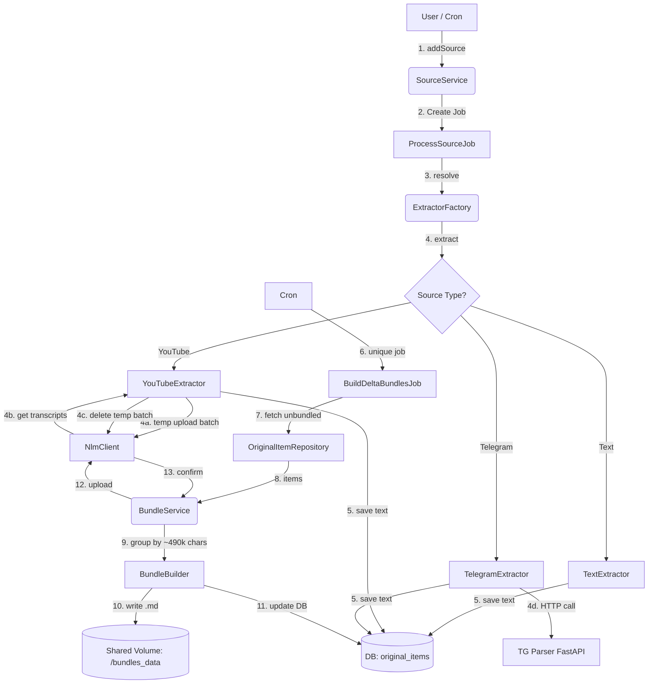

# Source Pipeline

## Архитектура и Интерфейсы (Source Pipeline)

### Общая схема (Data Flow)



### Ключевые классы и интерфейсы

*   **`SourceService` (Оркестратор)**: Главный фасад. Валидирует данные, создает `content_source`, диспатчит `ProcessSourceJob`.
*   **`ProcessSourceJob`**: Laravel Job (`ShouldBeUnique`). Вызывает `ExtractorFactory` и сохраняет результат.
*   **`ExtractorFactory`**: Возвращает нужный экстрактор на основе типа источника.
*   **`SourceExtractorInterface`**: Контракт `extract(ContentSource $source): string`.
    *   `URLExtractor`:Для url.
    *   `TextExtractor`: Возвращает готовый текст.
    *   `YouTubeExtractor`: Работает с `NlmClient` для пакетного извлечения транскриптов через временный блокнот.
    *   `TelegramExtractor`: Инициирует асинхронный парсинг через FastAPI.
*   **`BundleService`**: Управляет созданием дельта-бандлов. Вызывается по крону.
*   **`BundleBuilder`**: Инкапсулирует логику накопления текста до лимита ~490k символов и рендеринга MD-файла.

---

## Content Source Types

| Тип | Сервис | Примечание |
|---|---|---|
| Telegram channel | TG Scraper FastAPI | Поллинг новых постов по last_id |
| YouTube channel / playlist | yt-dlp FastAPI | Извлекает список video URLs; видео добавляются в NLM как YouTube-источники |

### YouTube Flow (Batched Extraction via Temporary Notebook)

yt-dlp service извлекает URL видео из канала/плейлиста. 
Для обычного текста, PDF и TG-постов мы извлекаем контент своими силами. 
Но для YouTube мы используем NLM как "черный ящик" для извлечения транскриптов.

Чтобы не превышать лимит NLM и не засорять основной блокнот пользователя, используется **Выделенный Временный Блокнот (Temporary Extraction Notebook)**.

```
1. yt-dlp: channel_url → [video_url_1, video_url_2, ...]
2. Получаем/создаем Temporary Extraction Notebook (один на пользователя или общий технический).
3. Разбиваем URL на пачки (batch_size = свободное кол-во источников в блокноте).
4. Для каждой пачки:
   a. пакетная загрузка URL во временный блокнот
   b. FastAPI извлекает транскрипты
   c. НЕМЕДЛЕННО удаляем эти URL из временного блокнота (освобождая слоты).
   d. Laravel сохраняет транскрипты в original_items.text.
5. Транскрипты пакуем в md-бандлы (как и обычный текст).
```

### Telegram Flow (Async Batched Webhooks)

Поскольку парсинг канала может занимать минуты (десятки тысяч постов), блокировать Laravel HTTP-запросом недопустимо. Используется асинхронная модель.

1. Laravel вызывает  TG scrapper FastAPI, передавая параметры парсинга и `webhook_url`.
2. FastAPI начинает парсинг и сразу возвращает 202 Accepted.
3. По мере парсинга FastAPI накапливает посты пачками (batch_size = 500-1000).
4. FastAPI отправляет `POST {webhook_url}` в Laravel с JSON-массивом постов.
5. Laravel принимает пачку, валидирует, сохраняет в `original_items` и отвечает 200 OK.
6. Процесс повторяется, пока канал не будет полностью распарсен.

---

## 🔗 Linked Content Extraction Flow (Извлечение связанных ссылок)

Посты в Telegram (и других источниках) часто содержат ссылки на другие материалы (YouTube, статьи, PDF). Чтобы не терять контекст и строить глубокую базу знаний, система автоматически извлекает эти ссылки, проверяет дубликаты и запрашивает подтверждение у пользователя.

### 1. Парсинг и классификация (Backend)
Во время работы `TelegramExtractor` (или любого другого экстрактора), текст каждого поста прогоняется через `LinkExtractorService`.
*   **Фильтрация:** Извлекаются только ссылки на поддерживаемые типы источников (YouTube, известные домены статей, PDF).
*   **Дедупликация:** Сервис проверяет БД (`content_sources.url`). Если ссылка уже существует (даже если она была добавлена из другого канала), она игнорируется и не предлагается пользователю.
*   **Создание кандидатов:** Уникальные ссылки сохраняются в `content_sources` со статусами:
    *   `discovery_method = 'auto_extracted'`
    *   `review_status = 'pending_review'`
    *   `parent_source_id` = ID источника, в котором была найдена ссылка.

### 2. Агрегация и Группировка (Smart Grouping)
Чтобы избежать "усталости от принятия решений" (decision fatigue) при первичной индексации канала с тысячами постов, Backend не отдает фронтенду плоский список из 500 ссылок. Вместо этого он агрегирует их по домену/типу:
*   "YouTube: 45 новых видео"
*   "Habr.com: 12 новых статей"
*   "Telegram (другие каналы): 80 ссылок"

### 3. UX: Подтверждение пользователем (Lazy vs Control)
Фронтенд получает сгруппированную статистику и предлагает два сценария взаимодействия:

**Сценарий А: "Ленивый" пользователь (Приоритет №1)**
*   Видит сводку: "Найдено 137 новых материалов в ссылках".
*   Нажимает одну кнопку: **"Индексировать всё найденное"**.
*   Все `candidates` получают `review_status = 'approved'` и уходят в очередь на парсинг (`ProcessSourceJob`).

**Сценарий Б: "Внимательный" пользователь (Точный контроль)**
*   Видит раскрывающиеся группы (аккордеоны).
*   Может развернуть группу "YouTube (45)" и увидеть превью (название видео, канал).
*   Может снять галочку с конкретной группы ("Не индексировать ссылки на Twitter") или с отдельных элементов.
*   Нажимает **"Индексировать выбранное"**.

*Дополнительно:* Пользователь может настроить правила (например, "Всегда автоматически индексировать YouTube" или "Всегда игнорировать домен X"). Эти правила применяются на этапе Парсинга и классификации автоматически.

### 4. Обработка и связь (Parent-Child)
После подтверждения пользователем (`review_status = 'approved'`), `ProcessSourceJob` обрабатывает эти новые источники (например, скачивает транскрипты YouTube или парсит статьи).
*   При сохранении извлеченного контента в `original_items`, поле `parent_item_id` связывает новый текст с тем самым оригинальным постом/документом, из которого была взята ссылка.
*   Это позволяет в интерфейсе показывать пользователю цепочки: "Эта транскрипция YouTube была найдена в посте от 15 января".

---

## MD Bundle Strategy

### Принцип: write-once

Бандл создаётся один раз, загружается в NotebookLM и **никогда не изменяется**. Новый контент → новый бандл. Ноль переиндексаций существующих бандлов.

---

### Первичная индексация

```
Все существующие посты / транскрипции
    ↓
Сортировка по дате публикации
    ↓
Пакуем в FULL бандлы (макс. 490k символов каждый, 10k margin)
    ↓
Загружаем в NotebookLM → ждём индексации
    ↓
Freeze навсегда — больше не трогаем
```

---

### Живые обновления

Scheduler Laravel запускается каждые N минут. 
**Важно:** Job для создания бандлов должен быть уникальным (`->unique()`), чтобы избежать race conditions при параллельном запуске scheduler'а.

```
1. Запрос к TG Scraper: новые посты с last_fetched_id
2. Сохраняем в original_items (md_bundle_id = null)
3. Обновляем content_sources.last_fetched_id

4. Проверяем буфер для этого content_source:
   unbundled_chars = SUM(LENGTH(text)) WHERE md_bundle_id IS NULL

5. Триггер создания нового дельта-бандла:
   IF unbundled_chars >= 50_000
   OR (последний дельта бандл обновлен > 24h назад AND unbundled_chars > 0):
       → компилируем md-файл
       → создаём md_bundle (status=PENDING)
       → ставим задачу в очередь на загрузку в NotebookLM

6. После загрузки:
   → обновляем notebooklm_source_id, status=INDEXED
   → проставляем md_bundle_id у упакованных original_items
```

---

## Bundle File Format

Каждый md-файл содержит посты с метаданными. Метаданные идут строго перед текстом поста (без пустой строки между ними). Посты разделяются пустой строкой.

```markdown
<!-- SOURCE_ID: tg_12345 | URL: https://t.me/channel/12345 | TS: 2024-01-15T10:30:00 -->
Текст поста 12345. Может быть многострочным.
Продолжение текста того же поста.

<!-- SOURCE_ID: tg_12346 | URL: https://t.me/channel/12346 | TS: 2024-01-15T11:00:00 -->
Текст поста 12346.

<!-- SOURCE_ID: yt_dQw4w9WgXcQ | URL: https://youtube.com/watch?v=dQw4w9WgXcQ | TS: 2024-01-10T00:00:00 -->
Транскрипция видео или описание.
```

**Формат SOURCE_ID:** `{type}_{external_id}`, например `tg_12345`, `yt_dQw4w9WgXcQ`.

---

## Citation Resolution

NotebookLM возвращает `cited_text` и `notebooklm_source_id` для каждой цитаты.

```
1. По notebooklm_source_id находим md_bundle
2. Читаем bundle file
3. Ищем cited_text substring в файле
4. Сканируем назад от позиции совпадения до первого <!-- SOURCE_ID: -->
5. Извлекаем external_id из метаданных
6. Достаём original_item WHERE external_id = extracted_id
7. Возвращаем: {url, text, published_at}
```

**Edge case: cited_text пересекает границу двух постов**

NotebookLM нарезает контент на чанки ~1-2k символов без учёта границ постов. Чанк может захватить конец одного поста и начало следующего.

Алгоритм вернёт пост, где цитата начинается (ближайший SOURCE_ID выше). Для MVP приемлемо.

Митигация: пустая строка-разделитель между постами снижает вероятность склейки в один чанк (уже заложено в формат).

---

## Обработка ошибок (Error Handling)

В `ProcessSourceJob` и экстракторах применяется матрица решений:

1. **Фатальные ошибки (Known/Fatal)**: 
   * *Примеры:* Видео приватное, невалидный URL, канал TG не существует.
   * *Действие:* Немедленный перевод `content_source` в статус `error`, сохранение `error_message` (понятного пользователю), отправка уведомления. Job завершается без retry.
2. **Транзитные ошибки (Unknown/Transient)**: 
   * *Примеры:* Таймаут NLM, 500 Internal Server Error, обрыв сети, временная недоступность TG API.
   * *Действие:* Исключение пробрасывается. Laravel Queue автоматически делает retry (например, 3 попытки с экспоненциальной задержкой).

## Метрики и Лимиты Бандлов

*   **Подсчет размера:** Используется строгий подсчет символов. Токенизация не требуется.
*   **Лимит бандла:** ~490,000 символов (с запасом 10k до жесткого лимита NLM в 500k).
*   **Стратегия:** Write-once. Бандлы не редактируются и не удаляются при изменении оригинальных постов (см. ограничения в `product.md`).

---

## DB Tables

> ⚠️ **Примечание:** Каноническая схема БД описана в `data-model.md`. Ниже приведена упрощённая версия для контекста Source Pipeline. В случае расхождений ориентируйтесь на `data-model.md`.

```sql
content_sources
  id                uuid pk
  knowledge_base_id fk
  type              enum(telegram, youtube)
  external_id       varchar         -- @channel или URL
  name              varchar
  last_fetched_id   varchar         -- последний tg post_id / yt video_id
  last_fetched_at   timestamp
  status            enum(active, paused, error)

original_items
  id                uuid pk
  content_source_id fk
  external_id       varchar         -- tg post_id / yt video_id
  url               varchar
  text              text
  published_at      timestamp
  md_bundle_id      uuid fk null    -- null = ещё не упакован
  created_at        timestamp

md_bundles
  id                    uuid pk
  knowledge_base_id     fk
  notebooklm_source_id  varchar null  -- null до загрузки
  type                  enum(full, delta)
  status                enum(pending, uploading, indexed, failed)
  first_item_id         uuid fk
  last_item_id          uuid fk
  char_count            int
  file_path             varchar
  uploaded_at           timestamp
  created_at            timestamp
```

### Indexes

```sql
CREATE INDEX ON original_items (content_source_id, published_at);
CREATE INDEX ON original_items (md_bundle_id) WHERE md_bundle_id IS NULL;
CREATE INDEX ON md_bundles (knowledge_base_id, status);
CREATE INDEX ON md_bundles (notebooklm_source_id);
```
